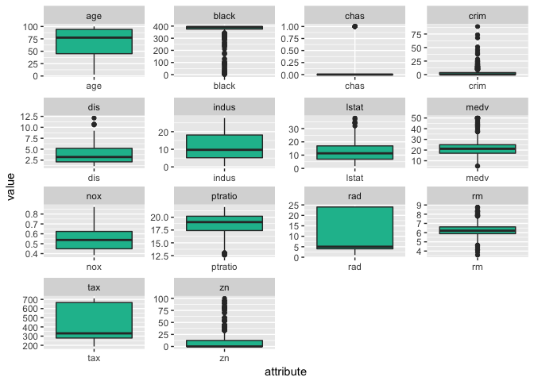
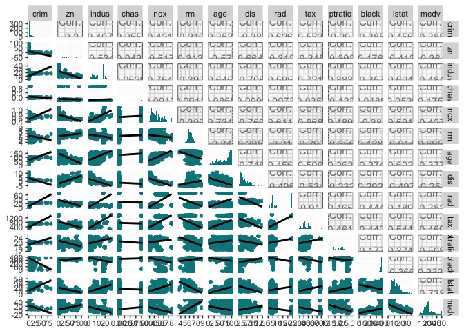
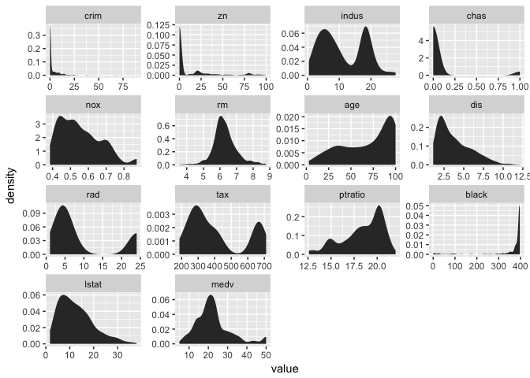
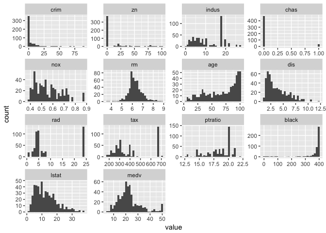
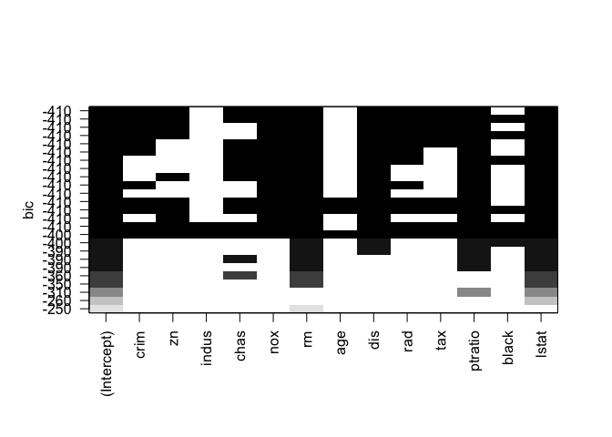

Subset Selection, Shrinkage Methods and Dimension Reduction
================

References
----------

1.  [Introduction to statistical learning](http://www-bcf.usc.edu/~gareth/ISL/)
2.  [Elements of statistical learning](https://statweb.stanford.edu/~tibs/ElemStatLearn/)
3.  [R Bloggers](https://www.r-bloggers.com/)

Purpose of the Case Study
-------------------------

Find alternative fitting approaches to the normal linear models besides the Ordinary Least Squares (OLS). OLS is ideal when the underlying relationship is Linear and we have n&gt;&gt;p. But if n is not much larger than p or p&gt;n, there can be a lot of variability in the fit which can result in either overfitting and very poor predictive ability.

Variable Selection: By **constraining** or **shrinking** the estimated coefficients, we can sucessfully reduce the variance associated with the model with a little increase in bias which improves the predictive accuracy.

Model Selection: We also want to compare between different advanced and more flexibile

Packages Used and Data subsetting
---------------------------------

The below packages are used for loading data, visualizations, model building and for creating creative plots of the results from each model.

``` r
library(MASS) #Boston Housing Data Set
library(dplyr) #Data Wrangling
library(tidyverse) #Data Wrangling
library(knitr) #Knitting RMDs and functionalities
library(reshape2) #Data Wrangling
library(ggplot2) #Data Visualization
library(GGally) #Data Visualization
library(leaps) #Best Subset selection
library(boot) #Resampling methods
library(rpart) #Tree modeling
library(rattle) #Better Vizzes
library(mgcv) #GAM modeling
library(neuralnet) #Neural Networks Model
library(plyr) #Data Wrangling
library(caret) #Cross Validation for Neural Networks
library(e1071) #SVM model
library(glmnet) #Ridge, Lasso and Elastic Regression
```

We set up the data using a random seed to sample the data into 75% training and 25% training data. We dont have sufficient data points to have a validation data as well.

``` r
#Set Seed
set.seed(10857825)
#Training and Testing Data
subset2 = sample(nrow(Boston), nrow(Boston) * 0.75)
Boston.train2 = Boston[subset2, ]
Boston.test2 = Boston[-subset2, ]
```

Basic Exploratory Analysis
--------------------------

We perform basic exploratory Analysis to understand the underlying variables and their dependancies. We have 506 observations with 14 different variables which are detailed as below.

``` r
kable(str(Boston))
```

    ## 'data.frame':    506 obs. of  14 variables:
    ##  $ crim   : num  0.00632 0.02731 0.02729 0.03237 0.06905 ...
    ##  $ zn     : num  18 0 0 0 0 0 12.5 12.5 12.5 12.5 ...
    ##  $ indus  : num  2.31 7.07 7.07 2.18 2.18 2.18 7.87 7.87 7.87 7.87 ...
    ##  $ chas   : int  0 0 0 0 0 0 0 0 0 0 ...
    ##  $ nox    : num  0.538 0.469 0.469 0.458 0.458 0.458 0.524 0.524 0.524 0.524 ...
    ##  $ rm     : num  6.58 6.42 7.18 7 7.15 ...
    ##  $ age    : num  65.2 78.9 61.1 45.8 54.2 58.7 66.6 96.1 100 85.9 ...
    ##  $ dis    : num  4.09 4.97 4.97 6.06 6.06 ...
    ##  $ rad    : int  1 2 2 3 3 3 5 5 5 5 ...
    ##  $ tax    : num  296 242 242 222 222 222 311 311 311 311 ...
    ##  $ ptratio: num  15.3 17.8 17.8 18.7 18.7 18.7 15.2 15.2 15.2 15.2 ...
    ##  $ black  : num  397 397 393 395 397 ...
    ##  $ lstat  : num  4.98 9.14 4.03 2.94 5.33 ...
    ##  $ medv   : num  24 21.6 34.7 33.4 36.2 28.7 22.9 27.1 16.5 18.9 ...

### Box Plots

The box plots indicate strongoutliers in the dependant variable `medv` and also in independant variables such as `crim`, `chas`, `black`,`rm` and `zn`. They also indicate that almost none of the variables are normally distributed.

``` r
Boston %>% 
  gather(key = "attribute", value = "value") %>%
  ggplot() +
  geom_boxplot(mapping = aes(x = attribute,
                             y = value),
               fill = "#1abc9c") +
  facet_wrap(~attribute, scales = "free")
```



### Correlation Plots

The correlation plots and the matrix indicate the relationship of dependant variable `medv`and other independant variables and also of multicollinearity between the independent variables. We find that `rm`, `ptratio` and `lstat` might be vary influential in determing `medv`

``` r
c<-round(cor(Boston),2)
kable(c)
```

|         |   crim|     zn|  indus|   chas|    nox|     rm|    age|    dis|    rad|    tax|  ptratio|  black|  lstat|   medv|
|---------|------:|------:|------:|------:|------:|------:|------:|------:|------:|------:|--------:|------:|------:|------:|
| crim    |   1.00|  -0.20|   0.41|  -0.06|   0.42|  -0.22|   0.35|  -0.38|   0.63|   0.58|     0.29|  -0.39|   0.46|  -0.39|
| zn      |  -0.20|   1.00|  -0.53|  -0.04|  -0.52|   0.31|  -0.57|   0.66|  -0.31|  -0.31|    -0.39|   0.18|  -0.41|   0.36|
| indus   |   0.41|  -0.53|   1.00|   0.06|   0.76|  -0.39|   0.64|  -0.71|   0.60|   0.72|     0.38|  -0.36|   0.60|  -0.48|
| chas    |  -0.06|  -0.04|   0.06|   1.00|   0.09|   0.09|   0.09|  -0.10|  -0.01|  -0.04|    -0.12|   0.05|  -0.05|   0.18|
| nox     |   0.42|  -0.52|   0.76|   0.09|   1.00|  -0.30|   0.73|  -0.77|   0.61|   0.67|     0.19|  -0.38|   0.59|  -0.43|
| rm      |  -0.22|   0.31|  -0.39|   0.09|  -0.30|   1.00|  -0.24|   0.21|  -0.21|  -0.29|    -0.36|   0.13|  -0.61|   0.70|
| age     |   0.35|  -0.57|   0.64|   0.09|   0.73|  -0.24|   1.00|  -0.75|   0.46|   0.51|     0.26|  -0.27|   0.60|  -0.38|
| dis     |  -0.38|   0.66|  -0.71|  -0.10|  -0.77|   0.21|  -0.75|   1.00|  -0.49|  -0.53|    -0.23|   0.29|  -0.50|   0.25|
| rad     |   0.63|  -0.31|   0.60|  -0.01|   0.61|  -0.21|   0.46|  -0.49|   1.00|   0.91|     0.46|  -0.44|   0.49|  -0.38|
| tax     |   0.58|  -0.31|   0.72|  -0.04|   0.67|  -0.29|   0.51|  -0.53|   0.91|   1.00|     0.46|  -0.44|   0.54|  -0.47|
| ptratio |   0.29|  -0.39|   0.38|  -0.12|   0.19|  -0.36|   0.26|  -0.23|   0.46|   0.46|     1.00|  -0.18|   0.37|  -0.51|
| black   |  -0.39|   0.18|  -0.36|   0.05|  -0.38|   0.13|  -0.27|   0.29|  -0.44|  -0.44|    -0.18|   1.00|  -0.37|   0.33|
| lstat   |   0.46|  -0.41|   0.60|  -0.05|   0.59|  -0.61|   0.60|  -0.50|   0.49|   0.54|     0.37|  -0.37|   1.00|  -0.74|
| medv    |  -0.39|   0.36|  -0.48|   0.18|  -0.43|   0.70|  -0.38|   0.25|  -0.38|  -0.47|    -0.51|   0.33|  -0.74|   1.00|

``` r
pairs <- ggpairs(Boston, 
                 lower=list(continuous=wrap("smooth",
                                            colour="turquoise4")),
                 diag=list(continuous=wrap("barDiag",
                                           fill="turquoise4")))  + 
  theme(panel.background = element_rect(fill = "gray98"),
        axis.line.y = element_line(colour="gray"),
        axis.line.x = element_line(colour="gray"))
pairs
```



### Density Plots and Histograms

The density plots and histograms reiterate that none of the variables have a perfectly normal distribution. `rm` has an almost normal distribution and the dependant variable `medv` has a right skewed distribution which can be log transformed to get a better model.

``` r
ggplot(data = melt(Boston), aes(x = value)) +
  stat_density() +
  facet_wrap(~variable, scales = "free")
```



``` r
ggplot(data = melt(Boston), aes(x = value)) +
  geom_histogram() +
  facet_wrap(~variable, scales = "free")
```



Model Performance Indicators
----------------------------

We will use the following paramters to explain the model performance and the intrinsic differences in the fitting of various models. We can extract all of these results from the fit statement which has a list of stored values for each model. **AIC**- Akaike's Information Criterion offers a relative estimate of the infomration lost wen a given model is used to fit the data. It deals with the trade-off between goodness of fit of the model and the complexity of the model. The lower the AIC, better the model. **BIC**- Bayesian Information Criterion/ Schwartz Criterion offers a similar trade-off between goodness of fit and complexity of model but penalizes the complexity more than AIC as the number of paramters added to the model increases, typically having BIC values &gt; AIC values. Lower the BIC, Better the model. **MSE**- Mean Square Error \#\# Variable Selection/Regularization As the number of predictors increaeses, we need to work with constraints or regularization to reduce the number of predictors by order of their importance or predictive ability. We have few commonly used methods and few rarely used methods due to complexity listed below: **SUBSET SELECTION**- Discrete Elimination, High Variance **1. Best Subsets Selection**- EXHAUSTIVE ALGORITHM This method typically finds the best subset of each size k which fits the model the best. It is typically feasible for small number of predictors as it becomes tedious as the predictors increase. **2.Forward Selection** This method uses a null model and builds up with one variable at a time and compares the p values of all the variables and uses that to remove the variables if insignificant. **3.Backward Selection** This method starts with a full model and starts reducing the predictors one at a time using p value to remove the insignificant variables. **4.Stepwise Selection**- GREEDY ALGORITHM This method uses a mix of forward and backward and hasthe ability to move in either direction adding one variable at a time till overfitting is detected. This is a greedy algorithm as the model with 5 variables is not the best model of size 5 like in best subsets. **SHRINKAGE METHODS**- Continous elimnation, Lower Variance **5.Ridge Regression** Ridge regression does not select variables but shrinks the correlated predictor coefficient estimates towards each other or zero based on the size of the tuning parameter/complexity paramater. While OLS regression estimates have high variability, by scaling, ridge regression acheives much lesser variability and MSE scores *but still has all variables in the model*. **6.LASSO** LASSO actually performs variable selection along with shrinkage and is prone to produce more interpretable models when compared to Ridge. LASSO also involves penalizing the OLS estimates of the betas but can zero out some of the betas and picks just one prdictor from a group of correlated variables (**reducing the number of variables in the model**) as it shrinks betas by fixed amounts whereas Ridge regression shrinks everything proportionally. The tuning paramters are determined by Cross Validation. **LASSO vs Ridge** Lasso performs better where there are small number of predictors with significant coefficients and others are very small or equal to zero whereas Ridge performs better when response is a function of a large number of predictors with coefficients of roughly the same size. **7. Elastic Net** Elastic Net mixes the penalty of ridge and lasso and is useful when the number of predictors is very large and we want to select more than one predictor from a group of correlated variables. It behaves similar to lasso but removes any degeneracies and wild behaviour caused by extreme correlations. We start with best subsets method, which tells us that `indus`, `age` and `black` may not be great predictors.

### Subset Selection Methods

``` r
#Variable Selection
par(mfrow=c(1,1))
#Best Subset Selection using BIC
subset_result2 = regsubsets(medv ~ ., data = Boston.train2, nbest = 2, nvmax = 14)
summary(subset_result2)
```

    ## Subset selection object
    ## Call: regsubsets.formula(medv ~ ., data = Boston.train2, nbest = 2, 
    ##     nvmax = 14)
    ## 13 Variables  (and intercept)
    ##         Forced in Forced out
    ## crim        FALSE      FALSE
    ## zn          FALSE      FALSE
    ## indus       FALSE      FALSE
    ## chas        FALSE      FALSE
    ## nox         FALSE      FALSE
    ## rm          FALSE      FALSE
    ## age         FALSE      FALSE
    ## dis         FALSE      FALSE
    ## rad         FALSE      FALSE
    ## tax         FALSE      FALSE
    ## ptratio     FALSE      FALSE
    ## black       FALSE      FALSE
    ## lstat       FALSE      FALSE
    ## 2 subsets of each size up to 13
    ## Selection Algorithm: exhaustive
    ##           crim zn  indus chas nox rm  age dis rad tax ptratio black lstat
    ## 1  ( 1 )  " "  " " " "   " "  " " " " " " " " " " " " " "     " "   "*"  
    ## 1  ( 2 )  " "  " " " "   " "  " " "*" " " " " " " " " " "     " "   " "  
    ## 2  ( 1 )  " "  " " " "   " "  " " "*" " " " " " " " " " "     " "   "*"  
    ## 2  ( 2 )  " "  " " " "   " "  " " " " " " " " " " " " "*"     " "   "*"  
    ## 3  ( 1 )  " "  " " " "   " "  " " "*" " " " " " " " " "*"     " "   "*"  
    ## 3  ( 2 )  " "  " " " "   "*"  " " "*" " " " " " " " " " "     " "   "*"  
    ## 4  ( 1 )  " "  " " " "   " "  " " "*" " " "*" " " " " "*"     " "   "*"  
    ## 4  ( 2 )  " "  " " " "   "*"  " " "*" " " " " " " " " "*"     " "   "*"  
    ## 5  ( 1 )  " "  " " " "   " "  "*" "*" " " "*" " " " " "*"     " "   "*"  
    ## 5  ( 2 )  " "  " " " "   " "  " " "*" " " "*" " " " " "*"     "*"   "*"  
    ## 6  ( 1 )  " "  " " " "   "*"  "*" "*" " " "*" " " " " "*"     " "   "*"  
    ## 6  ( 2 )  " "  "*" " "   " "  "*" "*" " " "*" " " " " "*"     " "   "*"  
    ## 7  ( 1 )  " "  "*" " "   "*"  "*" "*" " " "*" " " " " "*"     " "   "*"  
    ## 7  ( 2 )  "*"  " " " "   " "  "*" "*" " " "*" "*" " " "*"     " "   "*"  
    ## 8  ( 1 )  "*"  " " " "   "*"  "*" "*" " " "*" "*" " " "*"     " "   "*"  
    ## 8  ( 2 )  " "  " " " "   "*"  "*" "*" " " "*" "*" " " "*"     "*"   "*"  
    ## 9  ( 1 )  "*"  "*" " "   " "  "*" "*" " " "*" "*" "*" "*"     " "   "*"  
    ## 9  ( 2 )  "*"  " " " "   "*"  "*" "*" " " "*" "*" "*" "*"     " "   "*"  
    ## 10  ( 1 ) "*"  "*" " "   "*"  "*" "*" " " "*" "*" "*" "*"     " "   "*"  
    ## 10  ( 2 ) "*"  "*" " "   " "  "*" "*" " " "*" "*" "*" "*"     "*"   "*"  
    ## 11  ( 1 ) "*"  "*" " "   "*"  "*" "*" " " "*" "*" "*" "*"     "*"   "*"  
    ## 11  ( 2 ) "*"  "*" " "   "*"  "*" "*" "*" "*" "*" "*" "*"     " "   "*"  
    ## 12  ( 1 ) "*"  "*" " "   "*"  "*" "*" "*" "*" "*" "*" "*"     "*"   "*"  
    ## 12  ( 2 ) "*"  "*" "*"   "*"  "*" "*" " " "*" "*" "*" "*"     "*"   "*"  
    ## 13  ( 1 ) "*"  "*" "*"   "*"  "*" "*" "*" "*" "*" "*" "*"     "*"   "*"

``` r
plot(subset_result2)
```



We move on to Stepwise, Forward and Backward selection. All of them produce the same model which just removed the `indus` variable from the model.

``` r
#Stepwise
nullmodel<- glm(medv ~ 1, data = Boston.train2) #only for the intercept
fullmodel<- glm(medv ~ ., data = Boston.train2) #includes all variables
model.step<- step(nullmodel, scope = list(lower = nullmodel, upper = fullmodel),direction = "both")

#medv ~ lstat + rm + ptratio + chas + black + dis + nox + age + zn + tax + rad + crim
#Forward
model.forward<- step(nullmodel, scope = list(lower = nullmodel, upper = fullmodel),direction = "forward")
summary(model.forward)
#medv ~ lstat + rm + ptratio + chas + black + dis + nox + age + zn + tax + rad + crim
#Backward
model.backward<-step(fullmodel, direction = "backward")
summary(model.backward)
#medv ~ crim + zn + chas + nox + rm + age + dis + rad + tax + ptratio + black + lstat
#All same models
```

``` r
summary(model.step)
```

    ## 
    ## Call:
    ## glm(formula = medv ~ lstat + rm + ptratio + dis + nox + chas + 
    ##     zn + black + rad + tax + crim, data = Boston.train2)
    ## 
    ## Deviance Residuals: 
    ##      Min        1Q    Median        3Q       Max  
    ## -16.5918   -2.9063   -0.6522    1.6364   26.3239  
    ## 
    ## Coefficients:
    ##               Estimate Std. Error t value Pr(>|t|)    
    ## (Intercept)  35.692744   6.045118   5.904 8.07e-09 ***
    ## lstat        -0.508473   0.059559  -8.537 3.69e-16 ***
    ## rm            4.102841   0.492751   8.326 1.67e-15 ***
    ## ptratio      -0.946469   0.158982  -5.953 6.15e-09 ***
    ## dis          -1.481527   0.221704  -6.682 8.74e-11 ***
    ## nox         -19.537407   4.551670  -4.292 2.26e-05 ***
    ## chas          2.770311   1.082246   2.560  0.01087 *  
    ## zn            0.046733   0.016804   2.781  0.00570 ** 
    ## black         0.007867   0.003470   2.267  0.02396 *  
    ## rad           0.337870   0.079012   4.276 2.43e-05 ***
    ## tax          -0.011784   0.004109  -2.868  0.00437 ** 
    ## crim         -0.111102   0.040154  -2.767  0.00595 ** 
    ## ---
    ## Signif. codes:  0 '***' 0.001 '**' 0.01 '*' 0.05 '.' 0.1 ' ' 1
    ## 
    ## (Dispersion parameter for gaussian family taken to be 25.85454)
    ## 
    ##     Null deviance: 34152.5  on 378  degrees of freedom
    ## Residual deviance:  9488.6  on 367  degrees of freedom
    ## AIC: 2322.1
    ## 
    ## Number of Fisher Scoring iterations: 2

``` r
summary(model.forward)
```

    ## 
    ## Call:
    ## glm(formula = medv ~ lstat + rm + ptratio + dis + nox + chas + 
    ##     zn + black + rad + tax + crim, data = Boston.train2)
    ## 
    ## Deviance Residuals: 
    ##      Min        1Q    Median        3Q       Max  
    ## -16.5918   -2.9063   -0.6522    1.6364   26.3239  
    ## 
    ## Coefficients:
    ##               Estimate Std. Error t value Pr(>|t|)    
    ## (Intercept)  35.692744   6.045118   5.904 8.07e-09 ***
    ## lstat        -0.508473   0.059559  -8.537 3.69e-16 ***
    ## rm            4.102841   0.492751   8.326 1.67e-15 ***
    ## ptratio      -0.946469   0.158982  -5.953 6.15e-09 ***
    ## dis          -1.481527   0.221704  -6.682 8.74e-11 ***
    ## nox         -19.537407   4.551670  -4.292 2.26e-05 ***
    ## chas          2.770311   1.082246   2.560  0.01087 *  
    ## zn            0.046733   0.016804   2.781  0.00570 ** 
    ## black         0.007867   0.003470   2.267  0.02396 *  
    ## rad           0.337870   0.079012   4.276 2.43e-05 ***
    ## tax          -0.011784   0.004109  -2.868  0.00437 ** 
    ## crim         -0.111102   0.040154  -2.767  0.00595 ** 
    ## ---
    ## Signif. codes:  0 '***' 0.001 '**' 0.01 '*' 0.05 '.' 0.1 ' ' 1
    ## 
    ## (Dispersion parameter for gaussian family taken to be 25.85454)
    ## 
    ##     Null deviance: 34152.5  on 378  degrees of freedom
    ## Residual deviance:  9488.6  on 367  degrees of freedom
    ## AIC: 2322.1
    ## 
    ## Number of Fisher Scoring iterations: 2

``` r
summary(model.backward)
```

    ## 
    ## Call:
    ## glm(formula = medv ~ crim + zn + chas + nox + rm + dis + rad + 
    ##     tax + ptratio + black + lstat, data = Boston.train2)
    ## 
    ## Deviance Residuals: 
    ##      Min        1Q    Median        3Q       Max  
    ## -16.5918   -2.9063   -0.6522    1.6364   26.3239  
    ## 
    ## Coefficients:
    ##               Estimate Std. Error t value Pr(>|t|)    
    ## (Intercept)  35.692744   6.045118   5.904 8.07e-09 ***
    ## crim         -0.111102   0.040154  -2.767  0.00595 ** 
    ## zn            0.046733   0.016804   2.781  0.00570 ** 
    ## chas          2.770311   1.082246   2.560  0.01087 *  
    ## nox         -19.537407   4.551670  -4.292 2.26e-05 ***
    ## rm            4.102841   0.492751   8.326 1.67e-15 ***
    ## dis          -1.481527   0.221704  -6.682 8.74e-11 ***
    ## rad           0.337870   0.079012   4.276 2.43e-05 ***
    ## tax          -0.011784   0.004109  -2.868  0.00437 ** 
    ## ptratio      -0.946469   0.158982  -5.953 6.15e-09 ***
    ## black         0.007867   0.003470   2.267  0.02396 *  
    ## lstat        -0.508473   0.059559  -8.537 3.69e-16 ***
    ## ---
    ## Signif. codes:  0 '***' 0.001 '**' 0.01 '*' 0.05 '.' 0.1 ' ' 1
    ## 
    ## (Dispersion parameter for gaussian family taken to be 25.85454)
    ## 
    ##     Null deviance: 34152.5  on 378  degrees of freedom
    ## Residual deviance:  9488.6  on 367  degrees of freedom
    ## AIC: 2322.1
    ## 
    ## Number of Fisher Scoring iterations: 2

### Shrinkage Methods
