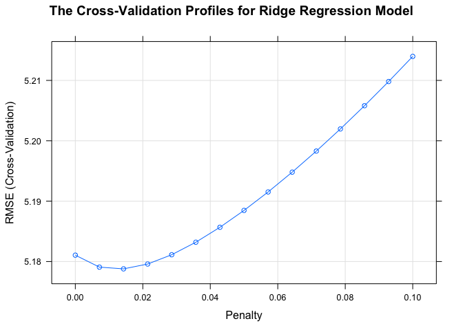
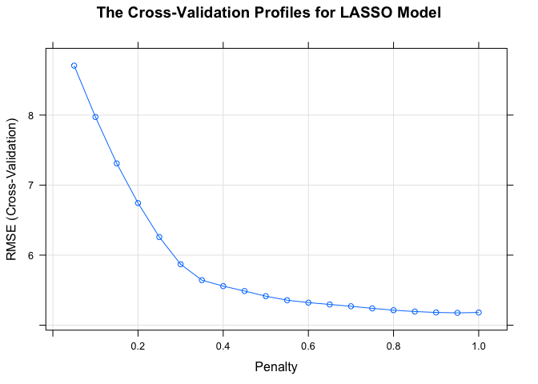
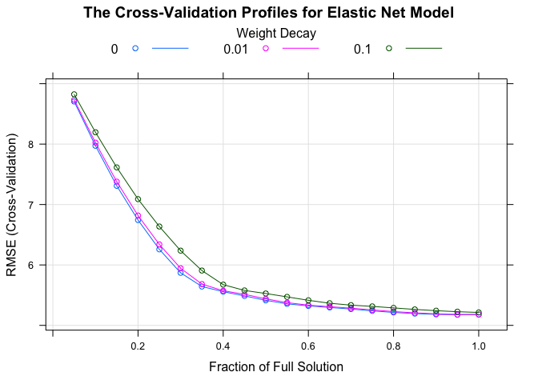
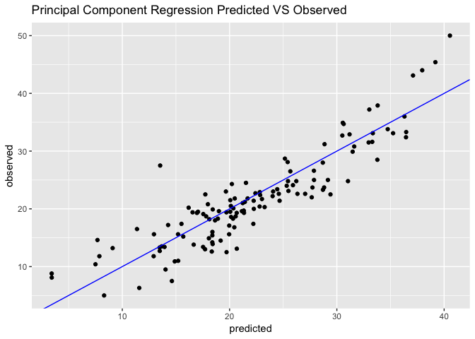
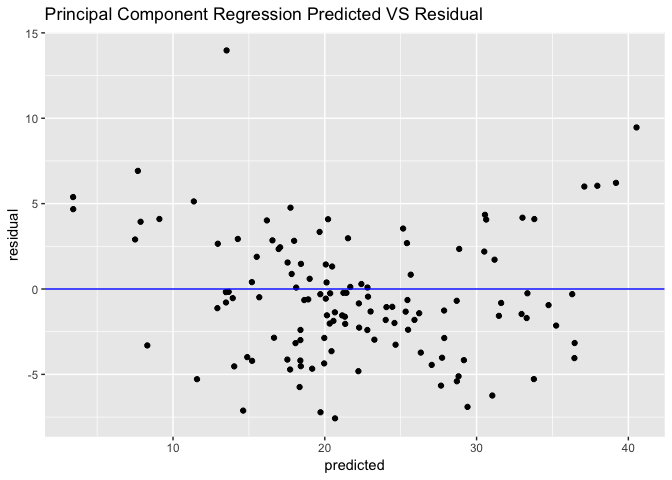
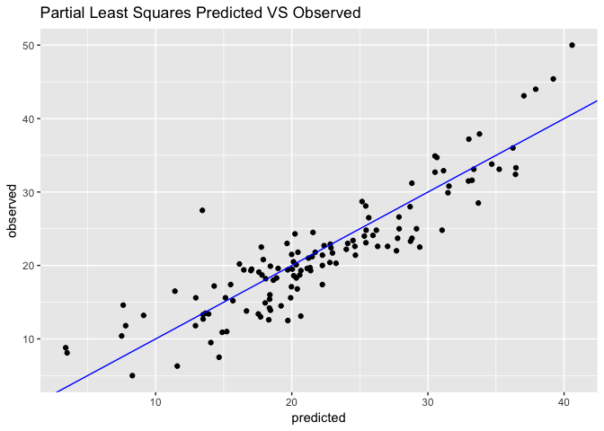
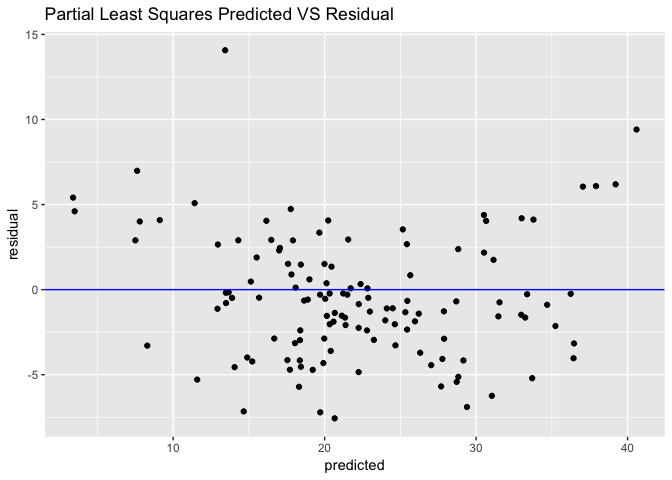
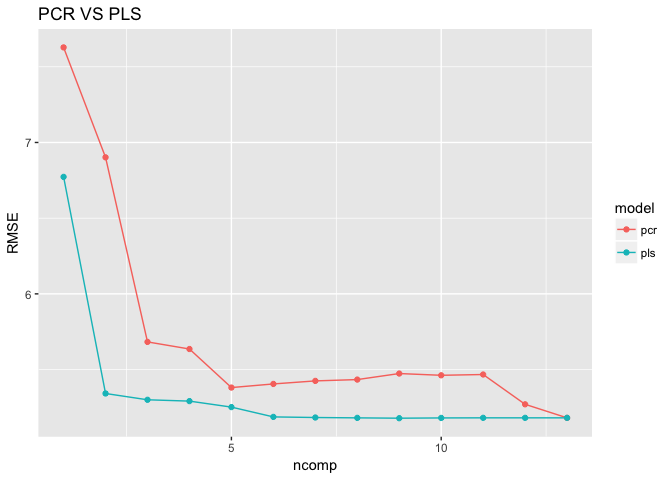
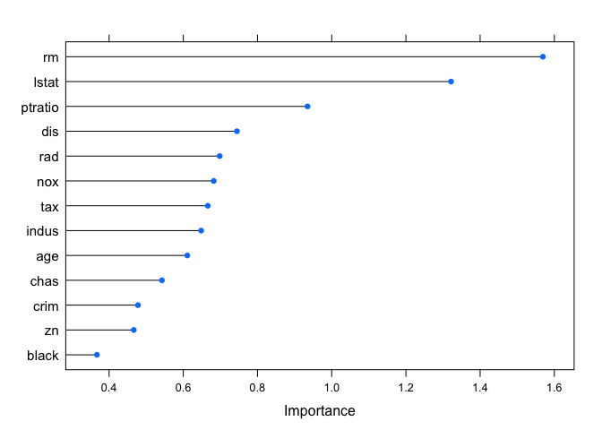

Subset Selection, Shrinkage Methods and Dimension Reduction
================

-   [References](#references)
-   [Purpose of the Case Study](#purpose-of-the-case-study)
-   [Packages Used and Data subsetting](#packages-used-and-data-subsetting)
-   [Basic Exploratory Analysis](#basic-exploratory-analysis)
    -   [Box Plots](#box-plots)
    -   [Correlation Plots](#correlation-plots)
    -   [Density Plots and Histograms](#density-plots-and-histograms)
-   [Model Performance Indicators](#model-performance-indicators)
-   [Variable Selection/Regularization](#variable-selectionregularization)
    -   [Subset Selection Methods - Discrete Elimination, High Variance](#subset-selection-methods---discrete-elimination-high-variance)
    -   [Shrinkage Methods - Continous elimination, Lower Variance](#shrinkage-methods---continous-elimination-lower-variance)
    -   [Dimension Reduction Methods](#dimension-reduction-methods)

References
----------

1.  [Introduction to statistical learning](http://www-bcf.usc.edu/~gareth/ISL/)
2.  [Elements of statistical learning](https://statweb.stanford.edu/~tibs/ElemStatLearn/)
3.  [R Bloggers](https://www.r-bloggers.com/)
4.  [Caret Package for Predictive Modeling](http://topepo.github.io/caret/visualizations.html)

Purpose of the Case Study
-------------------------

**Prediction Accuracy**:

Find alternative fitting approaches to the normal linear models besides the Ordinary Least Squares (OLS). OLS is ideal when the underlying relationship is Linear and we have n&gt;&gt;p. But if n is not much larger than p or p&gt;n (unfeasible for OLS), there can be a lot of variability in the fit which can result in either overfitting and very poor predictive ability.

**Model Interpretability**:

In multiple regression, we have the problem of using many predictors which don't add much to the predictive ability or are highly correlated or cause unncessary complexity in the model. So we propose the following methods to improve the model interpretability.

**Method 1: Subset Selection**

By selecting a subset of p predictors using different techniques which we believe has a concrete influence on the response, we try to fit the model using the simple least squares method.

**Method 2: Shrinkage**

By **constraining** or **shrinking** the estimated coefficients, we can sucessfully reduce the variance associated with the model with a little increase in bias which improves the predictive accuracy.

**Method 3: Dimension Reduction**

We can also use **dimension reduction** through which we can reduce the correlated variables. This method typically involved proejecting the predictors into a multidimensional subspace and computing different combinators or projections of the bbariables and these projections are used as predictors in the model.

Packages Used and Data subsetting
---------------------------------

The below packages are used for loading data, visualizations, model building and for creating creative plots of the results from each model.

``` r
library(MASS) #Boston Housing Data Set
library(dplyr) #Data Wrangling
library(tidyverse) #Data Wrangling
library(knitr) #Knitting RMDs and functionalities
library(reshape2) #Data Wrangling
library(ggplot2) #Data Visualization
library(GGally) #Data Visualization
library(leaps) #Best Subset selection
library(boot) #Resampling methods
library(rpart) #Tree modeling
library(rattle) #Better Vizzes
library(mgcv) #GAM modeling
library(neuralnet) #Neural Networks Model
library(plyr) #Data Wrangling
library(caret) #Ridge Regression and Lasso
library(e1071) #SVM model
library(lars)#Ridge Regression and Lasso
library(elasticnet) #Elastic Net
```

We set up the data using a random seed to sample the data into 75% training and 25% training data. We dont have sufficient data points to have a validation data as well.

``` r
#Set Seed
set.seed(10857825)
#Training and Testing Data
subset2 = sample(nrow(Boston), nrow(Boston) * 0.75)
Boston.train2 = Boston[subset2, ]
Boston.test2 = Boston[-subset2, ]
```

Basic Exploratory Analysis
--------------------------

We perform basic exploratory Analysis to understand the underlying variables and their dependancies. We have 506 observations with 14 different variables which are detailed as below.

``` r
kable(str(Boston))
```

    ## 'data.frame':    506 obs. of  14 variables:
    ##  $ crim   : num  0.00632 0.02731 0.02729 0.03237 0.06905 ...
    ##  $ zn     : num  18 0 0 0 0 0 12.5 12.5 12.5 12.5 ...
    ##  $ indus  : num  2.31 7.07 7.07 2.18 2.18 2.18 7.87 7.87 7.87 7.87 ...
    ##  $ chas   : int  0 0 0 0 0 0 0 0 0 0 ...
    ##  $ nox    : num  0.538 0.469 0.469 0.458 0.458 0.458 0.524 0.524 0.524 0.524 ...
    ##  $ rm     : num  6.58 6.42 7.18 7 7.15 ...
    ##  $ age    : num  65.2 78.9 61.1 45.8 54.2 58.7 66.6 96.1 100 85.9 ...
    ##  $ dis    : num  4.09 4.97 4.97 6.06 6.06 ...
    ##  $ rad    : int  1 2 2 3 3 3 5 5 5 5 ...
    ##  $ tax    : num  296 242 242 222 222 222 311 311 311 311 ...
    ##  $ ptratio: num  15.3 17.8 17.8 18.7 18.7 18.7 15.2 15.2 15.2 15.2 ...
    ##  $ black  : num  397 397 393 395 397 ...
    ##  $ lstat  : num  4.98 9.14 4.03 2.94 5.33 ...
    ##  $ medv   : num  24 21.6 34.7 33.4 36.2 28.7 22.9 27.1 16.5 18.9 ...

### Box Plots

The box plots indicate strongoutliers in the dependant variable `medv` and also in independant variables such as `crim`, `chas`, `black`,`rm` and `zn`. They also indicate that almost none of the variables are normally distributed.

``` r
Boston %>% 
  gather(key = "attribute", value = "value") %>%
  ggplot() +
  geom_boxplot(mapping = aes(x = attribute,
                             y = value),
               fill = "#1abc9c") +
  facet_wrap(~attribute, scales = "free")
```


### Correlation Plots

The correlation plots and the matrix indicate the relationship of dependant variable `medv`and other independant variables and also of multicollinearity between the independent variables. We find that `rm`, `ptratio` and `lstat` might be vary influential in determing `medv`

``` r
c<-round(cor(Boston),2)
kable(c)
```

|         |   crim|     zn|  indus|   chas|    nox|     rm|    age|    dis|    rad|    tax|  ptratio|  black|  lstat|   medv|
|---------|------:|------:|------:|------:|------:|------:|------:|------:|------:|------:|--------:|------:|------:|------:|
| crim    |   1.00|  -0.20|   0.41|  -0.06|   0.42|  -0.22|   0.35|  -0.38|   0.63|   0.58|     0.29|  -0.39|   0.46|  -0.39|
| zn      |  -0.20|   1.00|  -0.53|  -0.04|  -0.52|   0.31|  -0.57|   0.66|  -0.31|  -0.31|    -0.39|   0.18|  -0.41|   0.36|
| indus   |   0.41|  -0.53|   1.00|   0.06|   0.76|  -0.39|   0.64|  -0.71|   0.60|   0.72|     0.38|  -0.36|   0.60|  -0.48|
| chas    |  -0.06|  -0.04|   0.06|   1.00|   0.09|   0.09|   0.09|  -0.10|  -0.01|  -0.04|    -0.12|   0.05|  -0.05|   0.18|
| nox     |   0.42|  -0.52|   0.76|   0.09|   1.00|  -0.30|   0.73|  -0.77|   0.61|   0.67|     0.19|  -0.38|   0.59|  -0.43|
| rm      |  -0.22|   0.31|  -0.39|   0.09|  -0.30|   1.00|  -0.24|   0.21|  -0.21|  -0.29|    -0.36|   0.13|  -0.61|   0.70|
| age     |   0.35|  -0.57|   0.64|   0.09|   0.73|  -0.24|   1.00|  -0.75|   0.46|   0.51|     0.26|  -0.27|   0.60|  -0.38|
| dis     |  -0.38|   0.66|  -0.71|  -0.10|  -0.77|   0.21|  -0.75|   1.00|  -0.49|  -0.53|    -0.23|   0.29|  -0.50|   0.25|
| rad     |   0.63|  -0.31|   0.60|  -0.01|   0.61|  -0.21|   0.46|  -0.49|   1.00|   0.91|     0.46|  -0.44|   0.49|  -0.38|
| tax     |   0.58|  -0.31|   0.72|  -0.04|   0.67|  -0.29|   0.51|  -0.53|   0.91|   1.00|     0.46|  -0.44|   0.54|  -0.47|
| ptratio |   0.29|  -0.39|   0.38|  -0.12|   0.19|  -0.36|   0.26|  -0.23|   0.46|   0.46|     1.00|  -0.18|   0.37|  -0.51|
| black   |  -0.39|   0.18|  -0.36|   0.05|  -0.38|   0.13|  -0.27|   0.29|  -0.44|  -0.44|    -0.18|   1.00|  -0.37|   0.33|
| lstat   |   0.46|  -0.41|   0.60|  -0.05|   0.59|  -0.61|   0.60|  -0.50|   0.49|   0.54|     0.37|  -0.37|   1.00|  -0.74|
| medv    |  -0.39|   0.36|  -0.48|   0.18|  -0.43|   0.70|  -0.38|   0.25|  -0.38|  -0.47|    -0.51|   0.33|  -0.74|   1.00|

``` r
pairs <- ggpairs(Boston, 
                 lower=list(continuous=wrap("smooth",
                                            colour="turquoise4")),
                 diag=list(continuous=wrap("barDiag",
                                           fill="turquoise4")))  + 
  theme(panel.background = element_rect(fill = "gray98"),
        axis.line.y = element_line(colour="gray"),
        axis.line.x = element_line(colour="gray"))
pairs
```


### Density Plots and Histograms

The density plots and histograms reiterate that none of the variables have a perfectly normal distribution. `rm` has an almost normal distribution and the dependant variable `medv` has a right skewed distribution which can be log transformed to get a better model.

``` r
ggplot(data = melt(Boston), aes(x = value)) +
  stat_density() +
  facet_wrap(~variable, scales = "free")
```


``` r
ggplot(data = melt(Boston), aes(x = value)) +
  geom_histogram() +
  facet_wrap(~variable, scales = "free")
```


Model Performance Indicators
----------------------------

We will use the following paramters to explain the model performance and the intrinsic differences in the fitting of various models. We can extract all of these results from the fit statement which has a list of stored values for each model.

**AIC**- Akaike's Information Criterion offers a relative estimate of the infomration lost wen a given model is used to fit the data. It deals with the trade-off between goodness of fit of the model and the complexity of the model. It is defined for models fit by maximum likelihood function majorly and is proportional to another measure called Mallow's Cp.The lower the AIC and Mallow's Cp, better the model.

**BIC**- Bayesian Information Criterion/ Schwartz Criterion offers a similar trade-off between goodness of fit and complexity of model but penalizes the complexity more than AIC as the number of parameters added to the model increases, typically having BIC values &gt; AIC values and smaller models compared to AIC. Lower the BIC, Better the model.

**MSE**- Mean Square Error is the average distance between the observed values and the predicted values. Lower the MSE, more accurate the model.

Variable Selection/Regularization
---------------------------------

As the number of predictors increaeses, we need to work with constraints or regularization to reduce the number of predictors by order of their importance or predictive ability. We have few commonly used methods and few rarely used methods due to complexity listed below:

### Subset Selection Methods - Discrete Elimination, High Variance

**1. Best Subsets Selection**- EXHAUSTIVE ALGORITHM

This method typically finds the best subset of each size k which fits the model the best. It is typically feasible for small number of predictors (less than 30) as 2^p models exists where p is the number of predictors. It fits all models with k predictors where k is the size and selects a single best model of each size based on cross-validated prediction error. This method is highly computationally inefficient but provides the best model. So we have alternate methods.

**2.Forward Selection**

This method uses a null model and builds up with one variable at a time until all the predictors are added to the model. The order of addition depends on which predictor provided the best improvement to the fit until addition of extra variables will not guarantee any improvement to the model. This fits much lesser model when compared to best subset method. Forward can be applied even in conditions where p&gt;n while other methods cannot be used.

**3.Backward Selection**

This method starts with a full model and starts reducing the predictors one at a time based on the insignificance of that variable to the entire process. This cannot be used in conditions where p&gt;n.

**4.Stepwise Selection**- GREEDY ALGORITHM

This method uses a mix of forward and backward and has the ability to move in either direction adding one variable at a time till overfitting is detected. This method can also delete a variable which does not add much improvement to the fit and hence move in both direction.. This is a greedy algorithm as the model with 5 variables is not the best model of size 5, like in best subsets.

**Implementation**

We start with best subsets method, which tells us that `indus`, `age` and `black` may not be great predictors.

``` r
#Variable Selection
par(mfrow=c(1,1))
#Best Subset Selection using BIC
subset_result2 = regsubsets(medv ~ ., data = Boston.train2, nbest = 2, nvmax = 14)
summary(subset_result2)
```

    ## Subset selection object
    ## Call: regsubsets.formula(medv ~ ., data = Boston.train2, nbest = 2, 
    ##     nvmax = 14)
    ## 13 Variables  (and intercept)
    ##         Forced in Forced out
    ## crim        FALSE      FALSE
    ## zn          FALSE      FALSE
    ## indus       FALSE      FALSE
    ## chas        FALSE      FALSE
    ## nox         FALSE      FALSE
    ## rm          FALSE      FALSE
    ## age         FALSE      FALSE
    ## dis         FALSE      FALSE
    ## rad         FALSE      FALSE
    ## tax         FALSE      FALSE
    ## ptratio     FALSE      FALSE
    ## black       FALSE      FALSE
    ## lstat       FALSE      FALSE
    ## 2 subsets of each size up to 13
    ## Selection Algorithm: exhaustive
    ##           crim zn  indus chas nox rm  age dis rad tax ptratio black lstat
    ## 1  ( 1 )  " "  " " " "   " "  " " " " " " " " " " " " " "     " "   "*"  
    ## 1  ( 2 )  " "  " " " "   " "  " " "*" " " " " " " " " " "     " "   " "  
    ## 2  ( 1 )  " "  " " " "   " "  " " "*" " " " " " " " " " "     " "   "*"  
    ## 2  ( 2 )  " "  " " " "   " "  " " " " " " " " " " " " "*"     " "   "*"  
    ## 3  ( 1 )  " "  " " " "   " "  " " "*" " " " " " " " " "*"     " "   "*"  
    ## 3  ( 2 )  " "  " " " "   "*"  " " "*" " " " " " " " " " "     " "   "*"  
    ## 4  ( 1 )  " "  " " " "   " "  " " "*" " " "*" " " " " "*"     " "   "*"  
    ## 4  ( 2 )  " "  " " " "   "*"  " " "*" " " " " " " " " "*"     " "   "*"  
    ## 5  ( 1 )  " "  " " " "   " "  "*" "*" " " "*" " " " " "*"     " "   "*"  
    ## 5  ( 2 )  " "  " " " "   " "  " " "*" " " "*" " " " " "*"     "*"   "*"  
    ## 6  ( 1 )  " "  " " " "   "*"  "*" "*" " " "*" " " " " "*"     " "   "*"  
    ## 6  ( 2 )  " "  "*" " "   " "  "*" "*" " " "*" " " " " "*"     " "   "*"  
    ## 7  ( 1 )  " "  "*" " "   "*"  "*" "*" " " "*" " " " " "*"     " "   "*"  
    ## 7  ( 2 )  "*"  " " " "   " "  "*" "*" " " "*" "*" " " "*"     " "   "*"  
    ## 8  ( 1 )  "*"  " " " "   "*"  "*" "*" " " "*" "*" " " "*"     " "   "*"  
    ## 8  ( 2 )  " "  " " " "   "*"  "*" "*" " " "*" "*" " " "*"     "*"   "*"  
    ## 9  ( 1 )  "*"  "*" " "   " "  "*" "*" " " "*" "*" "*" "*"     " "   "*"  
    ## 9  ( 2 )  "*"  " " " "   "*"  "*" "*" " " "*" "*" "*" "*"     " "   "*"  
    ## 10  ( 1 ) "*"  "*" " "   "*"  "*" "*" " " "*" "*" "*" "*"     " "   "*"  
    ## 10  ( 2 ) "*"  "*" " "   " "  "*" "*" " " "*" "*" "*" "*"     "*"   "*"  
    ## 11  ( 1 ) "*"  "*" " "   "*"  "*" "*" " " "*" "*" "*" "*"     "*"   "*"  
    ## 11  ( 2 ) "*"  "*" " "   "*"  "*" "*" "*" "*" "*" "*" "*"     " "   "*"  
    ## 12  ( 1 ) "*"  "*" " "   "*"  "*" "*" "*" "*" "*" "*" "*"     "*"   "*"  
    ## 12  ( 2 ) "*"  "*" "*"   "*"  "*" "*" " " "*" "*" "*" "*"     "*"   "*"  
    ## 13  ( 1 ) "*"  "*" "*"   "*"  "*" "*" "*" "*" "*" "*" "*"     "*"   "*"

``` r
plot(subset_result2)
```


We move on to Stepwise, Forward and Backward selection. All of them produce the same model which just removed the `indus` variable from the model.

``` r
#Stepwise
nullmodel<- glm(medv ~ 1, data = Boston.train2) #only for the intercept
fullmodel<- glm(medv ~ ., data = Boston.train2) #includes all variables
model.step<- step(nullmodel, scope = list(lower = nullmodel, upper = fullmodel),direction = "both")

#medv ~ lstat + rm + ptratio + chas + black + dis + nox + age + zn + tax + rad + crim
#Forward
model.forward<- step(nullmodel, scope = list(lower = nullmodel, upper = fullmodel),direction = "forward")
summary(model.forward)
#medv ~ lstat + rm + ptratio + chas + black + dis + nox + age + zn + tax + rad + crim
#Backward
model.backward<-step(fullmodel, direction = "backward")
summary(model.backward)
#medv ~ crim + zn + chas + nox + rm + age + dis + rad + tax + ptratio + black + lstat
#All same models
```

``` r
summary(model.step)
```

    ## 
    ## Call:
    ## glm(formula = medv ~ lstat + rm + ptratio + dis + nox + chas + 
    ##     zn + black + rad + tax + crim, data = Boston.train2)
    ## 
    ## Deviance Residuals: 
    ##      Min        1Q    Median        3Q       Max  
    ## -16.5918   -2.9063   -0.6522    1.6364   26.3239  
    ## 
    ## Coefficients:
    ##               Estimate Std. Error t value Pr(>|t|)    
    ## (Intercept)  35.692744   6.045118   5.904 8.07e-09 ***
    ## lstat        -0.508473   0.059559  -8.537 3.69e-16 ***
    ## rm            4.102841   0.492751   8.326 1.67e-15 ***
    ## ptratio      -0.946469   0.158982  -5.953 6.15e-09 ***
    ## dis          -1.481527   0.221704  -6.682 8.74e-11 ***
    ## nox         -19.537407   4.551670  -4.292 2.26e-05 ***
    ## chas          2.770311   1.082246   2.560  0.01087 *  
    ## zn            0.046733   0.016804   2.781  0.00570 ** 
    ## black         0.007867   0.003470   2.267  0.02396 *  
    ## rad           0.337870   0.079012   4.276 2.43e-05 ***
    ## tax          -0.011784   0.004109  -2.868  0.00437 ** 
    ## crim         -0.111102   0.040154  -2.767  0.00595 ** 
    ## ---
    ## Signif. codes:  0 '***' 0.001 '**' 0.01 '*' 0.05 '.' 0.1 ' ' 1
    ## 
    ## (Dispersion parameter for gaussian family taken to be 25.85454)
    ## 
    ##     Null deviance: 34152.5  on 378  degrees of freedom
    ## Residual deviance:  9488.6  on 367  degrees of freedom
    ## AIC: 2322.1
    ## 
    ## Number of Fisher Scoring iterations: 2

``` r
summary(model.forward)
```

    ## 
    ## Call:
    ## glm(formula = medv ~ lstat + rm + ptratio + dis + nox + chas + 
    ##     zn + black + rad + tax + crim, data = Boston.train2)
    ## 
    ## Deviance Residuals: 
    ##      Min        1Q    Median        3Q       Max  
    ## -16.5918   -2.9063   -0.6522    1.6364   26.3239  
    ## 
    ## Coefficients:
    ##               Estimate Std. Error t value Pr(>|t|)    
    ## (Intercept)  35.692744   6.045118   5.904 8.07e-09 ***
    ## lstat        -0.508473   0.059559  -8.537 3.69e-16 ***
    ## rm            4.102841   0.492751   8.326 1.67e-15 ***
    ## ptratio      -0.946469   0.158982  -5.953 6.15e-09 ***
    ## dis          -1.481527   0.221704  -6.682 8.74e-11 ***
    ## nox         -19.537407   4.551670  -4.292 2.26e-05 ***
    ## chas          2.770311   1.082246   2.560  0.01087 *  
    ## zn            0.046733   0.016804   2.781  0.00570 ** 
    ## black         0.007867   0.003470   2.267  0.02396 *  
    ## rad           0.337870   0.079012   4.276 2.43e-05 ***
    ## tax          -0.011784   0.004109  -2.868  0.00437 ** 
    ## crim         -0.111102   0.040154  -2.767  0.00595 ** 
    ## ---
    ## Signif. codes:  0 '***' 0.001 '**' 0.01 '*' 0.05 '.' 0.1 ' ' 1
    ## 
    ## (Dispersion parameter for gaussian family taken to be 25.85454)
    ## 
    ##     Null deviance: 34152.5  on 378  degrees of freedom
    ## Residual deviance:  9488.6  on 367  degrees of freedom
    ## AIC: 2322.1
    ## 
    ## Number of Fisher Scoring iterations: 2

``` r
summary(model.backward)
```

    ## 
    ## Call:
    ## glm(formula = medv ~ crim + zn + chas + nox + rm + dis + rad + 
    ##     tax + ptratio + black + lstat, data = Boston.train2)
    ## 
    ## Deviance Residuals: 
    ##      Min        1Q    Median        3Q       Max  
    ## -16.5918   -2.9063   -0.6522    1.6364   26.3239  
    ## 
    ## Coefficients:
    ##               Estimate Std. Error t value Pr(>|t|)    
    ## (Intercept)  35.692744   6.045118   5.904 8.07e-09 ***
    ## crim         -0.111102   0.040154  -2.767  0.00595 ** 
    ## zn            0.046733   0.016804   2.781  0.00570 ** 
    ## chas          2.770311   1.082246   2.560  0.01087 *  
    ## nox         -19.537407   4.551670  -4.292 2.26e-05 ***
    ## rm            4.102841   0.492751   8.326 1.67e-15 ***
    ## dis          -1.481527   0.221704  -6.682 8.74e-11 ***
    ## rad           0.337870   0.079012   4.276 2.43e-05 ***
    ## tax          -0.011784   0.004109  -2.868  0.00437 ** 
    ## ptratio      -0.946469   0.158982  -5.953 6.15e-09 ***
    ## black         0.007867   0.003470   2.267  0.02396 *  
    ## lstat        -0.508473   0.059559  -8.537 3.69e-16 ***
    ## ---
    ## Signif. codes:  0 '***' 0.001 '**' 0.01 '*' 0.05 '.' 0.1 ' ' 1
    ## 
    ## (Dispersion parameter for gaussian family taken to be 25.85454)
    ## 
    ##     Null deviance: 34152.5  on 378  degrees of freedom
    ## Residual deviance:  9488.6  on 367  degrees of freedom
    ## AIC: 2322.1
    ## 
    ## Number of Fisher Scoring iterations: 2

The final results for the subset selection method are:
In-Sample MSE- 25.04
Out of Sample MSE- 13.23
AIC- 2323.87
BIC- 2375.06

### Shrinkage Methods - Continous elimination, Lower Variance

**1.Ridge Regression**

Ridge regression does not select variables but shrinks the correlated predictor coefficient estimates towards each other or zero based on the size of the tuning parameter/complexity paramater. When the tuning parameter is equal to 0, it becomes the OLS process.
Ridge regression also requires the predictors to be standardized (centered) before starting the regression. Ridge Regression shrinks the coefficients of the low-variance components more than the high variance components. While OLS regression estimates have high variability, by scaling, ridge regression acheives much lesser variability and MSE scores *but still has all variables in the model*.

**Ridge Vs OLS**

While OLS regression estimates have high variability, by scaling, ridge regression acheives much lesser variability and MSE scores *but still has all variables in the model*. As the tuning parameter increases, the variance decresses with little increase in the bias. Regular OLS has no bias but higher variance.

**2.LASSO**

LASSO actually performs variable selection along with shrinkage and is prone to produce more interpretable models when compared to Ridge. LASSO also involves penalizing the OLS estimates of the betas but can zero out some of the betas and picks just one prdictor from a group of correlated variables (**reducing the number of variables in the model**) as it shrinks betas by fixed amounts whereas Ridge regression shrinks everything proportionally. The tuning paramters are determined by Cross Validation.

**LASSO vs Ridge**

Lasso performs better where there are small number of predictors with significant coefficients and others are very small or equal to zero whereas Ridge performs better when response is a function of a large number of predictors with coefficients of roughly the same size.

**3. Elastic Net**

Elastic Net mixes the penalty of ridge and lasso and is useful when the number of predictors is very large and we want to select more than one predictor from a group of correlated variables. It behaves similar to lasso but removes any degeneracies and wild behaviour caused by extreme correlations.

**Implementation**

We start with Ridge Regression without Cross-Validation:

``` r
ridge <- train(medv ~., data = Boston.train2,
               method='ridge',
               lambda = 4,
               preProcess=c('scale', 'center'))
ridge
```

    ## Ridge Regression 
    ## 
    ## 379 samples
    ##  13 predictor
    ## 
    ## Pre-processing: scaled (13), centered (13) 
    ## Resampling: Bootstrapped (25 reps) 
    ## Summary of sample sizes: 379, 379, 379, 379, 379, 379, ... 
    ## Resampling results across tuning parameters:
    ## 
    ##   lambda  RMSE      Rsquared 
    ##   0e+00   5.404278  0.6848137
    ##   1e-04   5.404205  0.6848216
    ##   1e-01   5.435232  0.6831539
    ## 
    ## RMSE was used to select the optimal model using  the smallest value.
    ## The final value used for the model was lambda = 1e-04.

``` r
ridge.pred <- predict(ridge, Boston.test2)

mean((ridge.pred - Boston.test2$medv)^2)
```

    ## [1] 13.21636

We then perform Cross-Validation, where the tuning parameter was chosen by minimum RMSE. When there the tuning parameter is zero, the error is very high. As the tuning parameter increases, the error decreases but beyond a value, bias becomes larger and results in a under-fit model.

``` r
# Cross-Validation to pick lambda
ridge_grid <- expand.grid(lambda = seq(0, .1, length = 15))
set.seed(10857825)
ridge_model <- train(medv ~ .,
                     data = Boston.train2,
                     method = "ridge",
                     preProcess = c("center", "scale"),
                     tuneGrid = ridge_grid,
                     trControl = trainControl(method= "cv"))
ridge_model
```

    ## Ridge Regression 
    ## 
    ## 379 samples
    ##  13 predictor
    ## 
    ## Pre-processing: centered (13), scaled (13) 
    ## Resampling: Cross-Validated (10 fold) 
    ## Summary of sample sizes: 340, 342, 341, 342, 341, 341, ... 
    ## Resampling results across tuning parameters:
    ## 
    ##   lambda       RMSE      Rsquared 
    ##   0.000000000  5.181056  0.7118516
    ##   0.007142857  5.179074  0.7126688
    ##   0.014285714  5.178786  0.7132293
    ##   0.021428571  5.179586  0.7136164
    ##   0.028571429  5.181127  0.7138805
    ##   0.035714286  5.183199  0.7140542
    ##   0.042857143  5.185674  0.7141590
    ##   0.050000000  5.188467  0.7142100
    ##   0.057142857  5.191525  0.7142177
    ##   0.064285714  5.194809  0.7141902
    ##   0.071428571  5.198296  0.7141334
    ##   0.078571429  5.201966  0.7140518
    ##   0.085714286  5.205808  0.7139490
    ##   0.092857143  5.209813  0.7138279
    ##   0.100000000  5.213974  0.7136909
    ## 
    ## RMSE was used to select the optimal model using  the smallest value.
    ## The final value used for the model was lambda = 0.01428571.

``` r
ridge_pred <- predict(ridge_model, Boston.test2)
mean((ridge.pred - Boston.test2$medv)^2)
```

    ## [1] 13.21636

``` r
update(plot(ridge_model), xlab = "Penalty",
       main = "The Cross-Validation Profiles for Ridge Regression Model")
```



The following are the results:
Without Cross-Validation:
MSE - 13.217
R^2- 0.69
With Cross-Validation:
MSE- 13.15
R^2- 0.81

We can see that Ridge definitely has better MSE than the normal subset selection methods.

We then move on to Lasso Regression:

``` r
lasso <- train(medv ~., Boston.train2,
               method='lasso',
               preProc=c('scale','center')
               )
lasso
```

    ## The lasso 
    ## 
    ## 379 samples
    ##  13 predictor
    ## 
    ## Pre-processing: scaled (13), centered (13) 
    ## Resampling: Bootstrapped (25 reps) 
    ## Summary of sample sizes: 379, 379, 379, 379, 379, 379, ... 
    ## Resampling results across tuning parameters:
    ## 
    ##   fraction  RMSE      Rsquared 
    ##   0.1       8.223612  0.5576651
    ##   0.5       5.975169  0.6178078
    ##   0.9       5.767628  0.6463217
    ## 
    ## RMSE was used to select the optimal model using  the smallest value.
    ## The final value used for the model was fraction = 0.9.

``` r
lasso.pred <- predict(lasso, Boston.test2)
mean((lasso.pred - Boston.test2$medv)^2)
```

    ## [1] 13.04655

We then perform Cross-Validation:

``` r
lasso_grid <- expand.grid(fraction = seq(.05, 1, length = 20))
set.seed(10857825)
lasso_model <- train(medv ~ .,
                    data = Boston.train2,
                    method = "lasso",
                    preProcess = c("center", "scale"),
                    tuneGrid = lasso_grid,
                    trControl = trainControl(method= "cv"))
lasso_model
```

    ## The lasso 
    ## 
    ## 379 samples
    ##  13 predictor
    ## 
    ## Pre-processing: centered (13), scaled (13) 
    ## Resampling: Cross-Validated (10 fold) 
    ## Summary of sample sizes: 340, 342, 341, 342, 341, 341, ... 
    ## Resampling results across tuning parameters:
    ## 
    ##   fraction  RMSE      Rsquared 
    ##   0.05      8.705910  0.5846421
    ##   0.10      7.972541  0.6268941
    ##   0.15      7.309756  0.6385081
    ##   0.20      6.743178  0.6456456
    ##   0.25      6.258352  0.6686758
    ##   0.30      5.869861  0.6799014
    ##   0.35      5.642787  0.6837716
    ##   0.40      5.557555  0.6841122
    ##   0.45      5.487719  0.6897064
    ##   0.50      5.414259  0.6962137
    ##   0.55      5.356566  0.7010192
    ##   0.60      5.322273  0.7035982
    ##   0.65      5.296166  0.7054112
    ##   0.70      5.270311  0.7074060
    ##   0.75      5.239832  0.7098501
    ##   0.80      5.214213  0.7116899
    ##   0.85      5.194759  0.7128784
    ##   0.90      5.181519  0.7134548
    ##   0.95      5.175858  0.7132225
    ##   1.00      5.181056  0.7118516
    ## 
    ## RMSE was used to select the optimal model using  the smallest value.
    ## The final value used for the model was fraction = 0.95.

``` r
lasso_pred <- predict(lasso_model, Boston.test2)
mean((lasso.pred - Boston.test2$medv)^2)
```

    ## [1] 13.04655

``` r
update(plot(lasso_model), xlab = "Penalty",
       main = "The Cross-Validation Profiles for LASSO Model")
```

 The following are the results:
Without Cross-Validation:
MSE - 13.047
R^2- 0.67
With Cross-Validation:
MSE- 13.046
R^2- 0.71

We can see that Lasso definitely has better MSE than the Ridge Regression method also.

We then move to Elastic Net:

``` r
e_net <- train(medv ~., Boston.train2,
               method='enet',
               preProc=c('scale','center'))
e_net
```

    ## Elasticnet 
    ## 
    ## 379 samples
    ##  13 predictor
    ## 
    ## Pre-processing: scaled (13), centered (13) 
    ## Resampling: Bootstrapped (25 reps) 
    ## Summary of sample sizes: 379, 379, 379, 379, 379, 379, ... 
    ## Resampling results across tuning parameters:
    ## 
    ##   lambda  fraction  RMSE      Rsquared 
    ##   0e+00   0.050     8.641925  0.5093921
    ##   0e+00   0.525     5.571182  0.6493187
    ##   0e+00   1.000     5.403216  0.6727833
    ##   1e-04   0.050     8.642281  0.5093810
    ##   1e-04   0.525     5.571386  0.6492931
    ##   1e-04   1.000     5.403119  0.6727927
    ##   1e-01   0.050     8.779325  0.5070691
    ##   1e-01   0.525     5.661619  0.6372784
    ##   1e-01   1.000     5.433844  0.6720377
    ## 
    ## RMSE was used to select the optimal model using  the smallest value.
    ## The final values used for the model were fraction = 1 and lambda = 1e-04.

``` r
enet.pred <- predict(e_net, Boston.test2)
mean((enet.pred - Boston.test2$medv)^2)
```

    ## [1] 13.21636

We then perform Cross-Validation:

``` r
enet_grid <- expand.grid(lambda = c(0, 0.01, .1),
                        fraction = seq(.05, 1, length = 20))
set.seed(10857825)
enet_model <- train(medv ~ .,
                   data = Boston.train2,
                   method = "enet",
                   preProcess = c("center", "scale"),
                   tuneGrid = enet_grid,
                   trControl = trainControl(method= "cv"))
enet_model
```

    ## Elasticnet 
    ## 
    ## 379 samples
    ##  13 predictor
    ## 
    ## Pre-processing: centered (13), scaled (13) 
    ## Resampling: Cross-Validated (10 fold) 
    ## Summary of sample sizes: 340, 342, 341, 342, 341, 341, ... 
    ## Resampling results across tuning parameters:
    ## 
    ##   lambda  fraction  RMSE      Rsquared 
    ##   0.00    0.05      8.705910  0.5846421
    ##   0.00    0.10      7.972541  0.6268941
    ##   0.00    0.15      7.309756  0.6385081
    ##   0.00    0.20      6.743178  0.6456456
    ##   0.00    0.25      6.258352  0.6686758
    ##   0.00    0.30      5.869861  0.6799014
    ##   0.00    0.35      5.642787  0.6837716
    ##   0.00    0.40      5.557555  0.6841122
    ##   0.00    0.45      5.487719  0.6897064
    ##   0.00    0.50      5.414259  0.6962137
    ##   0.00    0.55      5.356566  0.7010192
    ##   0.00    0.60      5.322273  0.7035982
    ##   0.00    0.65      5.296166  0.7054112
    ##   0.00    0.70      5.270311  0.7074060
    ##   0.00    0.75      5.239832  0.7098501
    ##   0.00    0.80      5.214213  0.7116899
    ##   0.00    0.85      5.194759  0.7128784
    ##   0.00    0.90      5.181519  0.7134548
    ##   0.00    0.95      5.175858  0.7132225
    ##   0.00    1.00      5.181056  0.7118516
    ##   0.01    0.05      8.733742  0.5823014
    ##   0.01    0.10      8.024378  0.6259144
    ##   0.01    0.15      7.378963  0.6379291
    ##   0.01    0.20      6.817846  0.6440991
    ##   0.01    0.25      6.340201  0.6657902
    ##   0.01    0.30      5.944865  0.6783155
    ##   0.01    0.35      5.683255  0.6831502
    ##   0.01    0.40      5.572920  0.6835755
    ##   0.01    0.45      5.513616  0.6870080
    ##   0.01    0.50      5.439046  0.6937316
    ##   0.01    0.55      5.376099  0.6991118
    ##   0.01    0.60      5.335138  0.7024078
    ##   0.01    0.65      5.309062  0.7042517
    ##   0.01    0.70      5.284764  0.7061486
    ##   0.01    0.75      5.255503  0.7086137
    ##   0.01    0.80      5.228382  0.7106843
    ##   0.01    0.85      5.206892  0.7121554
    ##   0.01    0.90      5.190967  0.7130780
    ##   0.01    0.95      5.180242  0.7135020
    ##   0.01    1.00      5.178797  0.7129182
    ##   0.10    0.05      8.823934  0.5803455
    ##   0.10    0.10      8.196562  0.6250582
    ##   0.10    0.15      7.614462  0.6374114
    ##   0.10    0.20      7.089382  0.6429222
    ##   0.10    0.25      6.636350  0.6538374
    ##   0.10    0.30      6.236639  0.6711633
    ##   0.10    0.35      5.907273  0.6801222
    ##   0.10    0.40      5.673892  0.6842120
    ##   0.10    0.45      5.578123  0.6830044
    ##   0.10    0.50      5.527367  0.6830892
    ##   0.10    0.55      5.471406  0.6880491
    ##   0.10    0.60      5.414994  0.6935388
    ##   0.10    0.65      5.366147  0.6981653
    ##   0.10    0.70      5.334818  0.7012741
    ##   0.10    0.75      5.313891  0.7035408
    ##   0.10    0.80      5.288974  0.7061199
    ##   0.10    0.85      5.263972  0.7085988
    ##   0.10    0.90      5.242802  0.7106940
    ##   0.10    0.95      5.226077  0.7123932
    ##   0.10    1.00      5.213974  0.7136909
    ## 
    ## RMSE was used to select the optimal model using  the smallest value.
    ## The final values used for the model were fraction = 0.95 and lambda = 0.

``` r
enet_pred <- predict(enet_model, Boston.test2)
mean((enet_pred - Boston.test2$medv)^2)
```

    ## [1] 13.12737

``` r
update(plot(enet_model), main = "The Cross-Validation Profiles for Elastic Net Model")
```



The following are the results:
Without Cross-Validation:
MSE - 13.216
R^2- 0.68
With Cross-Validation:
MSE- 13.13
R^2- 0.71

We see that Lasso has the least MSE among the above methods and we can find the coefficients of the Lasso techniques which will give us the best model.

``` r
predict(lasso_model$finalModel, type='coef', mode='norm')$coefficients[15,]
```

    ##       crim         zn      indus       chas        nox         rm 
    ## -0.9468656  1.0098724  0.0000000  0.6974925 -2.0649416  3.0175378 
    ##        age        dis        rad        tax    ptratio      black 
    ## -0.1719365 -3.1220937  2.7497461 -1.8518407 -2.0222768  0.6780006 
    ##      lstat 
    ## -3.5712525

Which again gives us the same model as subset selection with just `indus` removed but with a better performance.

The above model did not suffer from very high variance between the variables thus not showing much difference between the different methods.

### Dimension Reduction Methods

Unlike the above methods where we contrlled for variance by subsets or by shrinking coefficients, we will now transform the predictor variables and then fit a least squares model using these transformed variables.

**1. Principal Components Regression**

PCA (Principal Component Analysis) is a methodology used to derive a low-dimensional set of features from a very large set of predictors. The first PC (principal component) direction of the data is along which the variance of the observations is the highest. This is the line which fits very closely to the data. The second PC is uncorrelated to first PC (orthogonal to first PC) and has the highest variance subjected to a constraint. We use linear combinations of data in orthogonal directions which maximize the variance captured by our model instead of dismissing a variable out of two correlated variables in OLS.
In Principle Components Regression, we construct M principal components and use these in a linear fashion to obtain the least squares. We fit the model only with those variables which explain most of the variability in the data and the relationship with the response variable, thus reducing the risk of overfitting.

There is no feature selection happening as it is a linear combination of all the p original features. PCR is better when the first few PCs are sufficient to capture most of the variation in the data.

**2. Partial Least Squares**

We don't use the response variable to determine the principal component directions, hence making it a unsupervised method. This reduces the guarantee of the principal components explaining the response completely.

Partial Least squares (PLS) method is more supervised dimension reduction technique which identifies a smaller set of features which are linear combinations of original features using the response variable to identify these new features.

The methods places higher weights on variables that are more related to the response variable. To attain the directions, PLS asjusts each of these variables for the first component by regressing them on first component and taking residuals. The residuals are the remaining information which has not been explained by the first PLS direction. This is them iterated M times to identify multiple PLS components.

**Implementation**

We start with PCR with Cross-Validation:

``` r
set.seed(10857825)
pcr_model <- train(medv ~ .,
                  data = Boston.train2,
                  method = "pcr",
                  preProcess = c("center", "scale"),
                  tuneGrid = expand.grid(ncomp = 1:13),
                  trControl = trainControl(method= "cv"))
summary(pcr_model)
```

    ## Data:    X dimension: 379 13 
    ##  Y dimension: 379 1
    ## Fit method: svdpc
    ## Number of components considered: 13
    ## TRAINING: % variance explained
    ##           1 comps  2 comps  3 comps  4 comps  5 comps  6 comps  7 comps
    ## X           46.96    58.06    67.76    74.34    80.65    85.71    89.74
    ## .outcome    33.62    46.79    63.29    65.84    68.15    68.23    68.23
    ##           8 comps  9 comps  10 comps  11 comps  12 comps  13 comps
    ## X           92.78    94.89     96.60     98.13     99.51    100.00
    ## .outcome    68.62    68.62     68.91     69.57     71.38     72.23

``` r
pcr_pred <- predict(pcr_model, Boston.test2)
mean((pcr_pred - Boston.test2$medv)^2)
```

    ## [1] 13.21715

``` r
df_pcr <- data.frame(predicted = pcr_pred, observed = Boston.test2$medv,
                    residual = Boston.test2$medv - pcr_pred)

ggplot(df_pcr, aes(x = predicted, y = observed)) +
  geom_point() +
  geom_abline(intercept = 0, slope = 1, colour = "blue") +
  ggtitle("Principal Component Regression Predicted VS Observed")
```



``` r
ggplot(df_pcr, aes(x = predicted, y = residual)) +
  geom_point() +
  geom_hline(yintercept = 0, colour = "blue") +
  ggtitle("Principal Component Regression Predicted VS Residual")
```



The following are the results:
With Cross-Validation:
MSE- 13.22
R^2- 0.72 which was very similar to the previous results on subsets and shrinkage methods, LASSO seems to be the best till now.

We move on to PLS with Cross-Validation:

``` r
set.seed(10857825)
pls_model <- train(medv ~ .,
                  data = Boston.train2,
                  method = "pls",
                  preProcess = c("center", "scale"),
                  tuneGrid = expand.grid(ncomp = 1:13),
                  trControl = trainControl(method= "cv"))
pls_model
```

    ## Partial Least Squares 
    ## 
    ## 379 samples
    ##  13 predictor
    ## 
    ## Pre-processing: centered (13), scaled (13) 
    ## Resampling: Cross-Validated (10 fold) 
    ## Summary of sample sizes: 340, 342, 341, 342, 341, 341, ... 
    ## Resampling results across tuning parameters:
    ## 
    ##   ncomp  RMSE      Rsquared 
    ##    1     6.772785  0.4969822
    ##    2     5.341923  0.7007097
    ##    3     5.300352  0.7069505
    ##    4     5.291587  0.7047638
    ##    5     5.252015  0.7062137
    ##    6     5.187311  0.7116443
    ##    7     5.183253  0.7116776
    ##    8     5.180944  0.7117240
    ##    9     5.178708  0.7121836
    ##   10     5.180484  0.7119228
    ##   11     5.181156  0.7118441
    ##   12     5.181064  0.7118509
    ##   13     5.181056  0.7118516
    ## 
    ## RMSE was used to select the optimal model using  the smallest value.
    ## The final value used for the model was ncomp = 9.

``` r
pls_pred <- predict(pls_model, Boston.test2)
mean((pls_pred - Boston.test2$medv)^2)
```

    ## [1] 13.2497

``` r
df_pls <- data.frame(predicted = pls_pred, observed = Boston.test2$medv,
                    residual = Boston.test2$medv - pls_pred)

ggplot(df_pls, aes(x = predicted, y = observed)) +
  geom_point() +
  geom_abline(intercept = 0, slope = 1, colour = "blue") +
  ggtitle("Partial Least Squares Predicted VS Observed")
```



``` r
ggplot(df_pls, aes(x = predicted, y = residual)) +
  geom_point() +
  geom_hline(yintercept = 0, colour = "blue") +
  ggtitle("Partial Least Squares Predicted VS Residual")
```



``` r
# visualization to compare pcr and pls models
pcr_model$results$model <- "pcr"
pls_model$results$model <- "pls"

df_pcr_pls <- rbind(pcr_model$results, pls_model$results)
ggplot(df_pcr_pls, aes(x = ncomp, y = RMSE, colour = model)) +
  geom_line() +
  geom_point() +
  ggtitle("PCR VS PLS")
```



``` r
# rank the importance of the predictors
pls_imp <- varImp(pls_model, scale = FALSE)
plot(pls_imp, scales = list(y = list(cex = .95)))
```



The following are the results:
With Cross-Validation:
MSE- 13.25
R^2- 0.71 but we find an interesting observation when we compare PLS with PCR, PLS finds the minimum RMSE with just 10 components while the unsupervised PCR takes 13 components to find it. So, we find PLS builds simpler and more useful models. We can also compute the importance of each variable and find `rm`(number of rooms in the dwelling) to be very important.
